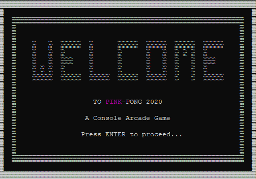
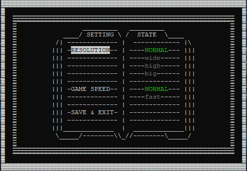
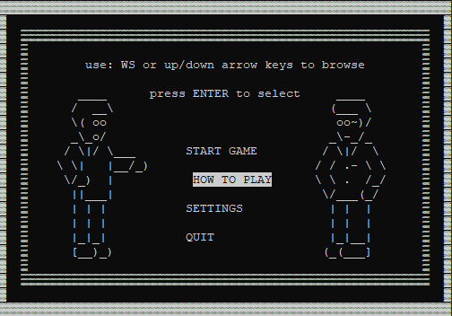
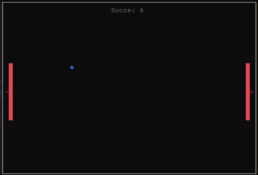

# Pink-Pong 2020
This is my first complete project. It's a console app that does not use any external libraries. My intention was to keep it as simple as possible. Since I still consider myself as a beginner I wanted to create something that will help me understend object oriented programming and force to use what I learned from internet. Watching or reading without practice is very unefficient so it was just a matter of time for me to start creating something
## What is it?
It's an arcade game. Gameplay is very simple, Player just tries to hit the ball with paddles by moving them up and down by pressing W/S or Up/Down

## Playability
Not really, you would be bored very quickly playing this game. My intention was to practice coding .NET apps but in a way that gives satistfaction and allows to publish it on github so I cen recieve some tips and guidance from more experienced users

## Is it ready?
Most important features are already implemented, there are couple of things that I want to add or replace here and there in the future, like more realisting ball movement or adding sound effects. But I'm not planning to make any major changes as I want to move to next WPF project

## Limitations
The game has a lot of them. For example console window size shouldn't be changed manualy by dragging the edge of a window, because it ruins all the graphical interface, it should be only accesed through settings. Also console onscreen position is not restricted in any manner so it may not be displayed as I intended to.
### But...
maybe there are ways to controll widow position and fix all the issues but I did not find a right way yet, or the way requires using some external code. Of course if you have any suggestions or tips, I would be more than happy to hear them.

## The Idea
originally I was just following a [video tutorial](https://www.youtube.com/watch?v=jn4M6WMscrw) on how to make a simple console pong game, but later I decided to change and add a lot of functionality, the settings, whole menu. I changed for example ball movement, It is now running on timespan instead of putting a thread to sleep which allows to move paddles faster. Sure I started with someones else idea but I really put a lot of time and effort to develop it by myself after remaking basic structure from tutorial, so I think that I deserve to call it my own creation.

